# TBOT v1 マニュアル

## 目次
<!-- TOC -->

- [TBOT v1 マニュアル](#tbot-v1-マニュアル)
  - [目次](#目次)
  - [始め方](#始め方)
    - [用意するもの](#用意するもの)
      - [LINE notify token](#line-notify-token)
      - [BITMEX API key と API secret](#bitmex-api-key-と-api-secret)
      - [Tradingviewの有料アカウント](#tradingviewの有料アカウント)
    - [初期設定](#初期設定)
      - [TBOT本体の設定方法](#tbot本体の設定方法)
      - [Tradingviewの設定](#tradingviewの設定)
      - [命令の挙動](#命令の挙動)
      - [稼働テスト](#稼働テスト)
    - [実稼働](#実稼働)
  - [細かい設定方法](#細かい設定方法)
    - [ストップタイプ](#ストップタイプ)
  - [細かい仕様](#細かい仕様)
    - [本アプリケーションの動作仕様](#本アプリケーションの動作仕様)
    - [気をつけるべきこと](#気をつけるべきこと)

<!-- /TOC -->

----------

## 始め方
本項ではこのbotを使うにあたって用意すべきものを紹介し、まず注文を入れて見るところまでを説明します。また、設定時の注意点なども合わせて紹介します。
### 用意するもの
大まかに2つあります.
* 通知系
* Line notify token
  * プログラムからLineへ通知を送る際に必要です。
* BITMEX APIKEY and api secret
  * 発注の際に使います
* Tradingviewの有料アカウント
#### LINE notify token
* みなさんLineについては言わずもがな持っているかと思います。今回はLineに対してプログラムが通知を送るための準備をします。

  
  
* Line notify とはプログラムから自分のLineへ通知を送る際に使うサービスです。その際Line notify tokenという個人に紐付いたトークン(ランダムな文字列)が必要になります。  
* トークンの取得方法
  * [Line notify](https://notify-bot.line.me/ja/)へアクセスしてログイン
  * 右上の∨を押してマイページへ移動

    
  * 下の方に行くとトークンを発行するというボタンがあるので選択

    
  * トークン名を適当な名前にし、1:1でLine notifyから通知を受け取るを選択し、発行します。

    
  * すると、このような画面が表示され、真ん中のエリアにトークンが表示されるのでこちらをメモなどに控えておきましょう。

    
  * これで、Line notifyトークンの発行は完了です。
#### BITMEX API key と API secret
* BITMEXにおいて、プログラムから注文を発行したり、ポジションの情報を取得するためにBITMEX API keyおよびAPI secretというものが必要になってきます。
* apikey secretの取得方法
  * 本アプリケーションを購入いただいた段階でBitmexのアカウントは持っているかと思いますので、アカウント作成などは割愛いたします。
  * BITMEXの上段メニューにAPIという項目があります(画像上四角)。これを押すと画像のような画面になり、左側に「APIキーの管理」という項目がありますのでこれを押します。

    
  * するとAPIの発行フォームが出てくるので適切な値を入れます。
    * 名前は適当なものをつけておくとよいでしょう。
    * キーのアクセス許可は注文にします。
    * 出金については本ボットでは触れることはないのでチェックを付けないようにしてください。(漏洩した場合大変なことになりますので)
    * 2要素トークンを入力し、発行を押すと下の方にAPIキー(ID)とシークレット(秘密)が表示されるのでメモしておきましょう。

    
  * これで、api key secretの取得は完了です。
#### Tradingviewの有料アカウント
* この商品を買っていただいた段階でTradinviewのアカウントは持っていただけていると思いますが、アラートを複数作る場合は有料のアカウントが必要です。
* こちらの[有料プラン選択](https://jp.tradingview.com/gopro/)で有料プランを選択してください。少なくとも4つのアラートが作れれば一つの戦略を運用できると思いますので最も安いものでも大丈夫だと思います。
### 初期設定
* TBOT本体の設定方法
  * GoogleAPIの認証
  * GoogleFusionTablesの有効化
* Tradingviewのアラート設定方法
* 
#### TBOT本体の設定方法
* noteにてあるTBOTのリンクを踏むとTBOT v1というシートが開かれます。
* 左上のファイルを選択し、コピーを作成を選択します。
* マイドライブに保存を選択すると自分のGoogle Driveに保存されます。

  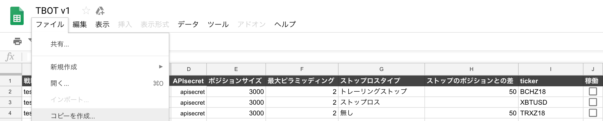
* 次に、「調整項目」というシートを開いてください(おそらく最初に開かれているはずです)。
* こちらにはbotの基本的な情報を入力します。
* 一旦下の２つを消して、1行にした状態で設定しましょう。(複数回したい場合は都度追加していってください)
* それぞれの項目について説明します。
  * 戦略シンボル 
    * 必須
    * 戦略の名称です
    * Tradingviewにおいてアラートメッセージを設定するときにこれと同じシンボルを指定することで対応させることができます。
  * プラットフォーム
    * 必須
    * ▼を押すと選択肢が現れます。
    * bitmexかbitmex_testネットしか無いです。
  * APIkey, APIsecret
    * 必須
    * プラットフォームに対応するapikeyとapisecretを入力します。
    * bitmexであれば先程説明したものをそれぞれ入力してください。
  * ポジションサイズ
    * 必須
    * 一回の注文で入れる契約サイズです。
  * 最大ピラミッディング
    * 必須
    * ピラミッディングの回数を指定します。
    * ポジションサイズを分割ではなく、そのまま発注するので、サイズ3000でピラミッディング2であれば、2度発注した場合3000*2 = 6000となります.
  * ストップロスタイプ
    * 必須
    * 注文発注時に同時にストップロスを入れるかどうかについて設定します。
    * ストップロス、トレーリングストップ、無しの3択です。
  * ストップのポジションとの差
    * ストップロスタイプが無しでないときに必須
    * ストップロスのポジションとの差額を設定します。
    * 単位は商品の契約サイズですので、btc/altなどの取引のとき、0.0001ずらしたいときはそのまま入力してください.
  * ticker
    * 必須
    * プラットフォームにおける商品ペアです.
    * プラットフォームを変更すると自動で選択肢が切り替わります。
  * 稼働
    * オンオフをチェックボックスで切り替えることができます。
    * オフであればbotが稼働中でも当該戦略は動きません。

    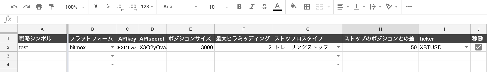
* メッセージ設定
  * 次に通知周りの設定をします.
  * 「メッセージ」タブを開いていただくと、画像のような入力フォームがあります.
  * プラットフォームはLineとslackを選択できます。
  * Lineの場合先程説明してあるLine notifyトークンを入力していただければ通知が来るようになります。
  * slackについてはincoming webhook urlを入力していただければ大丈夫です。こちらを使う人はそもそも詳しいと思いますが、参考までに[SlackのWebhook URL取得手順](https://qiita.com/vmmhypervisor/items/18c99624a84df8b31008)

    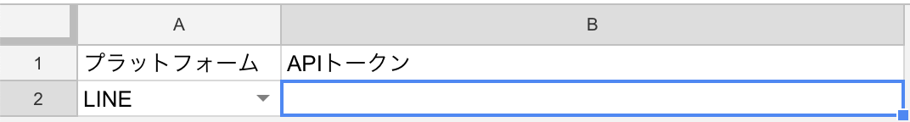

* 上記の入力が完了したら、次にメニューバーを見ると、「TBOTControl」というものが表示されており、こちらを押すと、
  * Run bot - botを稼働させる. 1分ごとにアラートを監視
  * Stop bot - botを停止させる
  * Test order - 1回だけbotを実験する. 実行時に入力項目をチェックしてくれる.
* という3つの選択肢があります.
* とりあえず、入力チェックがてらTest orderをしましょう
  * このとき、GoogleAPI周りの認証のため、いくつか作業が必要です。
  * Google APP Scriptの認証
    * Test orderをするとこのような画面が出てきます。

      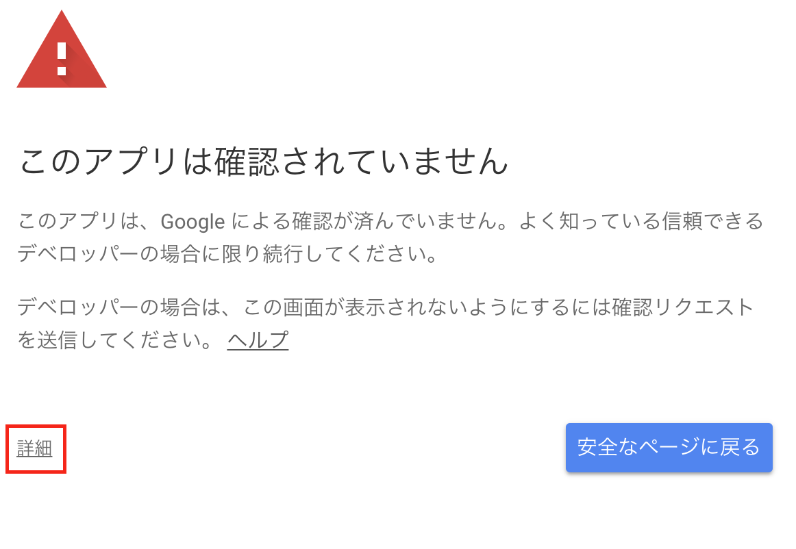
    * 左下の詳細ボタンを押すとこのようになります。

      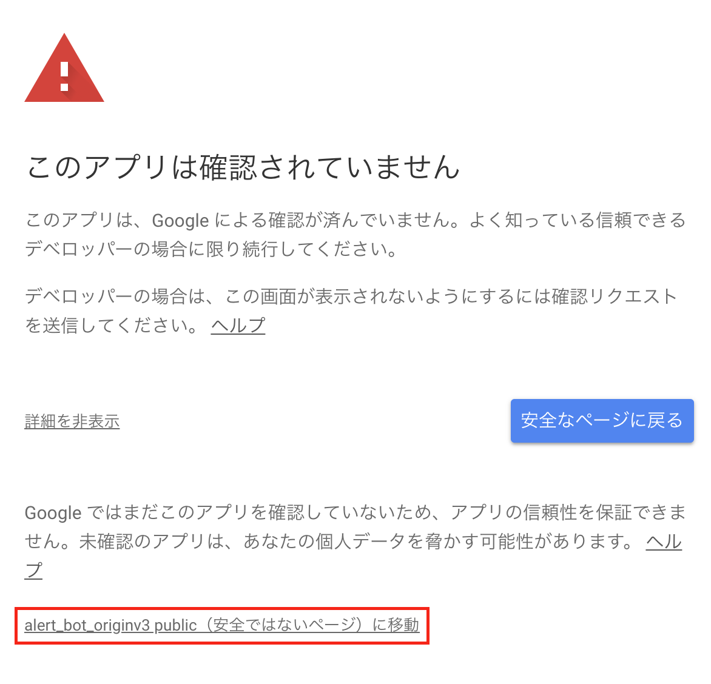

    * 「右のalert_bot_originv3 public(安全ではないページ) に移動」をクリックすると認証画面に移ります。
    * ここで認証していただければ、入力チェックが行われます。
  * 入力チェックが正しくないとこのようなエラーが出てきます。
  
    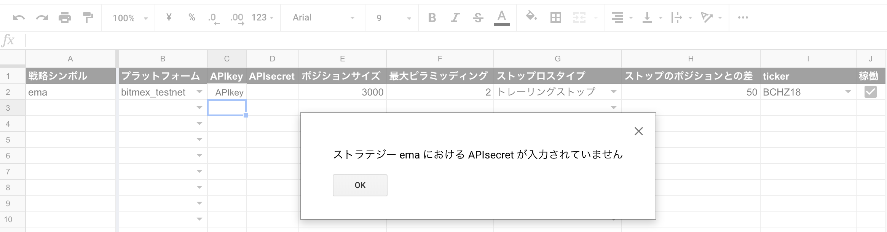 

  * 入力が正しくないときに表示されますが、戦略が存在するのに項目が入力されていないときや、APIkey APIsecretが正しくないときに発生します。
  * これを解決すると次にfusiontablesの有効化作業があります。

  * Google fusion tablesの有効化
    * 先程の認証と入力チェックを終えるとこのようなエラーが出てくると思います。
      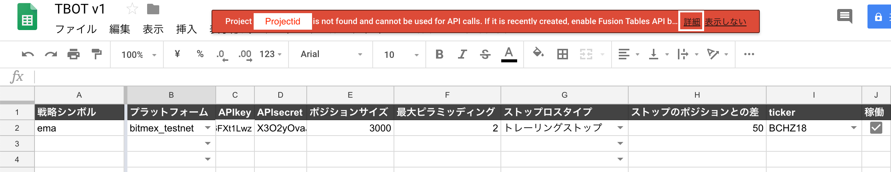

    * ここで詳細ボタンを押していただくと、次のメッセージが出てきますので、このリンクをコピーしてurl欄に貼り付けてください(ブラウザのタブを変えた方が効率が良いです)。
      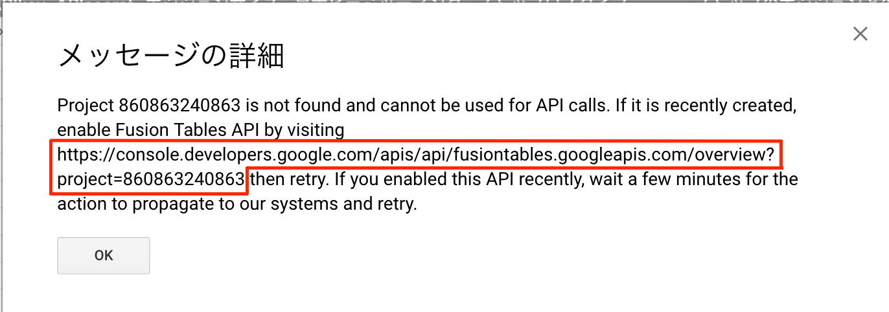

    * すると、このような画面になると思いますので、有効化ボタンを押せばfusiontablesが有効化されます。
      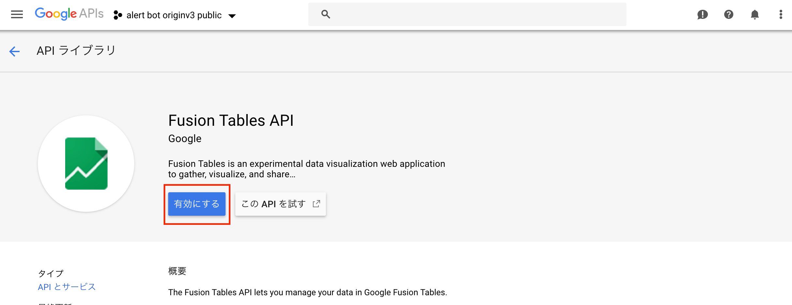

  * 再度Test orderを押す前にTradingviewからアラートメッセージが来ていて未読な場合何が起きるかわからないので、一旦それを既読にするか削除にしておきましょう。
  * 「テストメッセージ」という文面が通知媒体に流れて、エラーなく終わるはずです。

    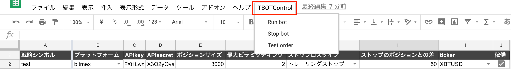

#### Tradingviewの設定
* アラートメッセージの送信先を設定します。
  * 送信先についてはTradingviewのプロフィール設定から設定できます.
  * こちらのEmailの部分にTBOTを使うgoogleアカウントのメールを送信していただければ大丈夫です。
    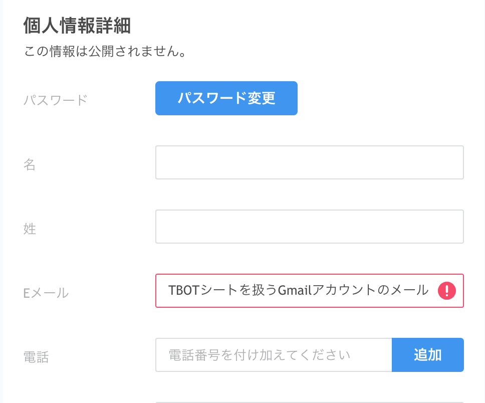

  * ※アラートを戦略から発生させる方法は割愛します。後ほど説明します。tr[Tradingview上で戦略に応じてアラートメッセージを設定する方法](https://blog.tradingview.com/ja/alerts-in-pine-1633/).
  * 1つのアラートメッセージに含むことができる情報は２つです.
    * 命令4つのどれか「Long, Short, CloseLong,  CloseShort」
    * 戦略シンボル
  * この２つを以下のように設定します。
      
    ```strategy-operation:命令:strategy-operation strategy-symbol:戦略シンボル:strategy-symbol```

  * 実際の設定だと画像のとおりになります。
  
    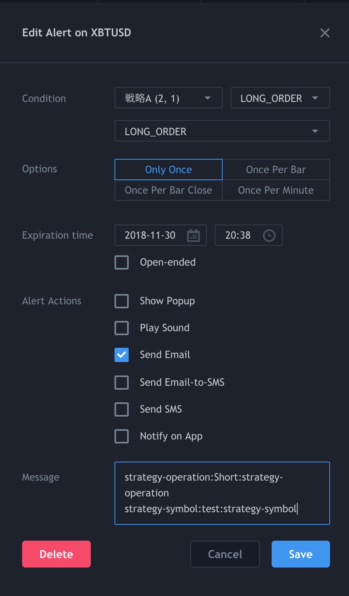
* この場合、戦略シンボルが「test」のもので、Shortオーダーを出してくれるものです。
* これを戦略に従ってLong Short(exitするのであればClose系)を設定すればTradingviewの設定は大丈夫です(サンプルストラテジーを参考に設定する例)。
#### 命令の挙動
* Long Short LongClose ShortCloseの挙動を説明します.
  * いずれも成行注文です。
  * 最大ピラミッディング回数に達したら同じ方向の注文アラートを無視するようになります。ピラミッディング数は「戦略ステータス」タブから確認できます。
  * ただし、ポジションが0のときは如何なる状態でも新しく注文を発注します。(ストップロスでロスカットされた場合など)
  * Shortポジションを持っているとき、Long命令が来たときはドテンします。
  * Close系はLongCloseの場合、Longポジションを閉じます。逆のポジションのときは無視します。Shortの場合も同様です。
  * bitmexなどはサーバーが重いとき注文を弾きますが、そういったときは最大15回2秒ごとに繰り返し発注します。
  1. Long
    * 買い注文を入れます。

#### 稼働テスト
* 後はちゃんと取引所に注文が送れるかテストしてみましょう。
* 画像のように絶対に発生するアラートを作って一度きりに設定してアラートを発生させてください。

  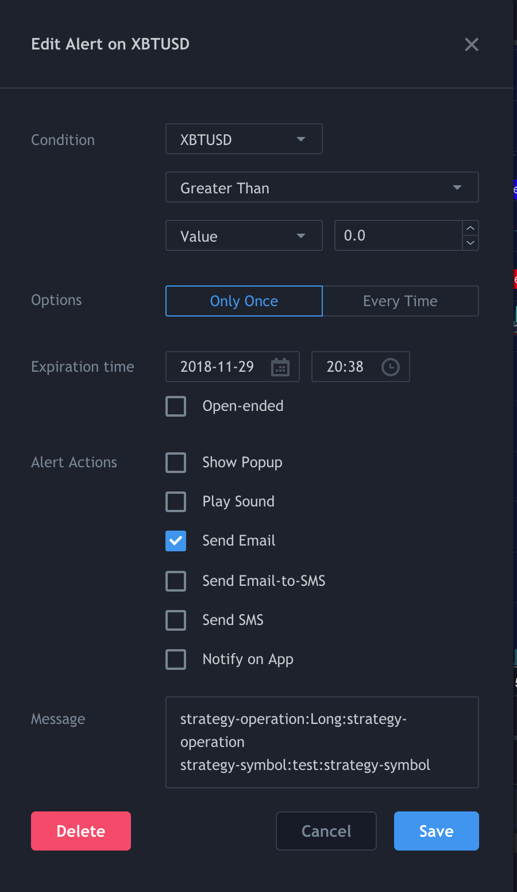
* この場合、対象は戦略シンボルtestのストラテジーで命令はロングになっています。事前に調整項目を設定してあると思うので、そのシンボルと違うのであれば合わせておいてください。なお、プラットフォームがbitmex_testnetでないなら傷を浅くするためにポジションサイズは極小にしておきましょう。
* これでsaveをするとアラートが発生しますので(少しラグはあります)、TBOTControlからTest orderを選択してください。
* 今回のケースですとLongなので、該当する戦略シンボルのポジションサイズ分の注文が入っているはずです。
* 確認したら次はCloseLongの命令のメッセージに更新して、再度アラートを発生させてください。これでポジションが決済されます。
* ここまで問題なくできていれば問題なく稼働するでしょう。あとはピラミッディングやポジションサイズやストップロスなどを好きな値に設定してください。
### 実稼働
* 例えば複数ストラテジーを回すのであれば画像のように並べます。
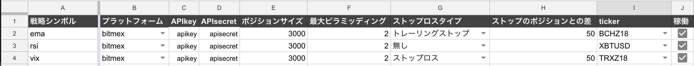
* この状態で一回Test orderをして問題なければ本番稼動をするといった運用が望ましいです。
* Tradingviewの方のアラートも当該戦略シンボルで、LongとShortのペアが設定されていれば大丈夫です。
* TBOTControlからRun botをしていただければ、botが動き始めます。
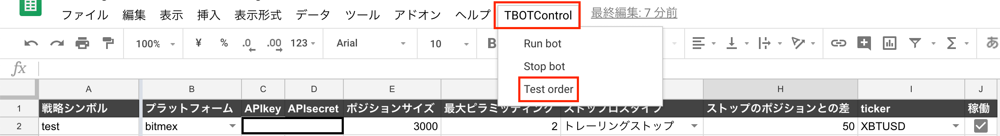
* 1分に1回gmailを確認して、メールが来ていたらアラートを読み、発注します。
* アラートの書き方が間違えているとチャットにエラー通知が幾度となく飛んでくるので、1回Test orderを必ずやってアラートメッセージが正しく書かれ、正しく送信されるかどうかについて

-----
## 細かい設定方法
### ストップタイプ
  * トレーリングストップ
    * 値動きに対してトレイル値の距離を置きながら追跡する形のストップロスです。
    * ストップのポジションとの差がトレイル値になります。
  * ストップロス
    * 固定の値で損切りラインを設定するタイプのストップロスです。
-----
## 細かい仕様
### 本アプリケーションの動作仕様
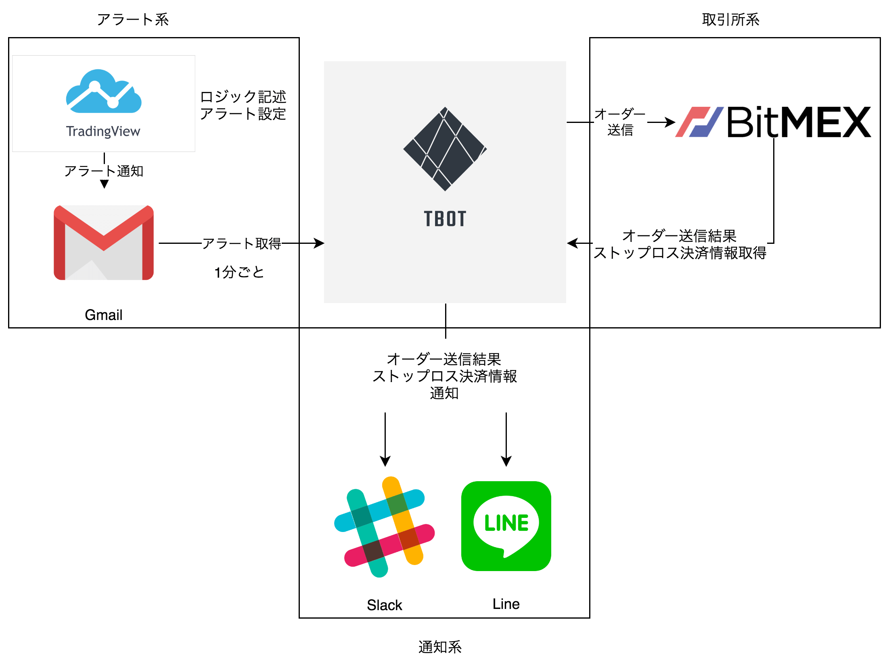

* 毎分1回すること
  * Gamilからのアラート取得
* 15分に一回すること
  * Bitmexにストップロスの状態を確認しにいきます。ストップロスが存在しない場合はリクエストすることはありません。

### 気をつけるべきこと
* 1分に1回注文を見るということなので、1分足のロジックなどで使う場合は大きくずれが生じる可能性があります。
* 十分に無視できる30分足程度からの戦略で使うほうがいいかとおもいます。