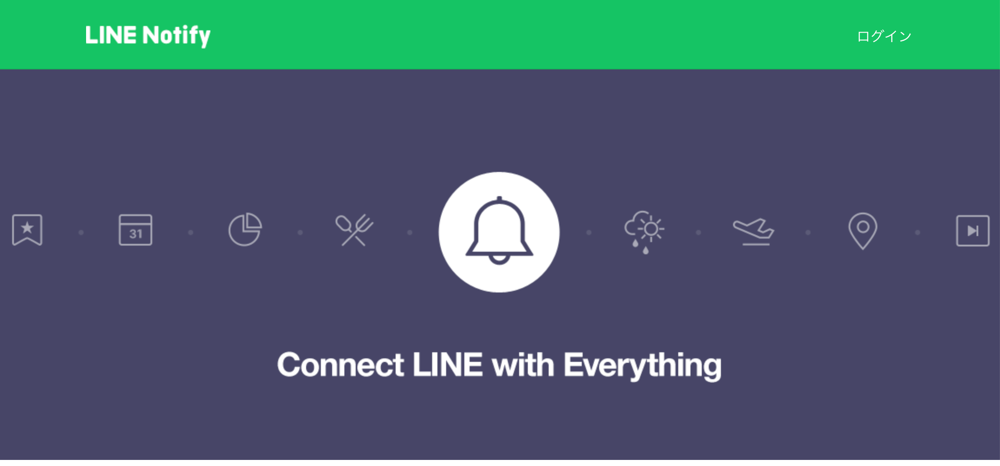
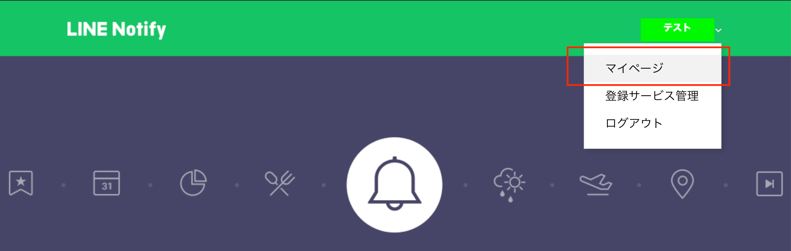
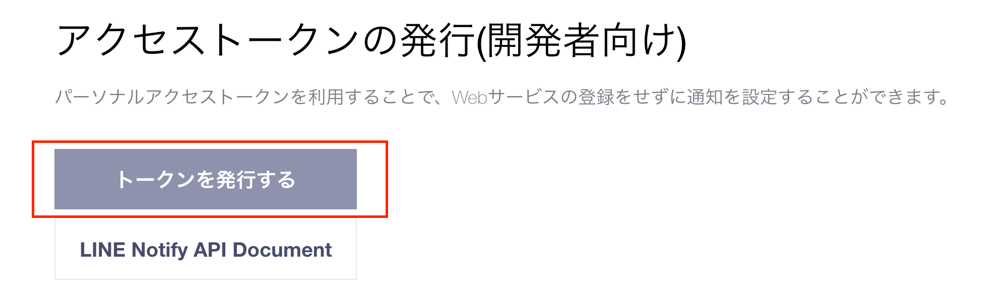
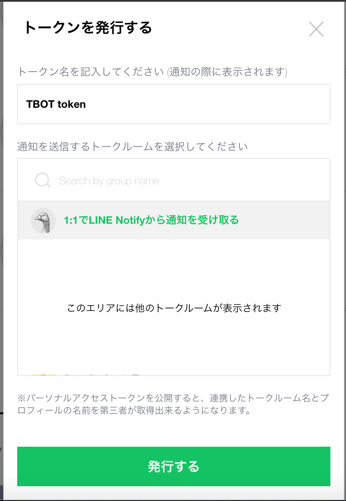
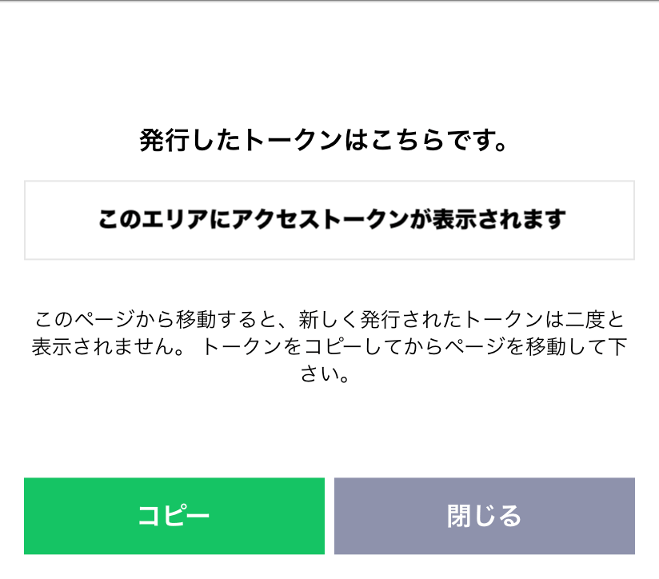
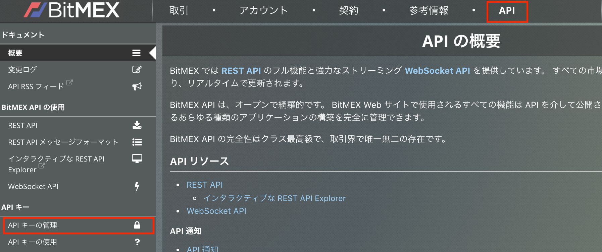
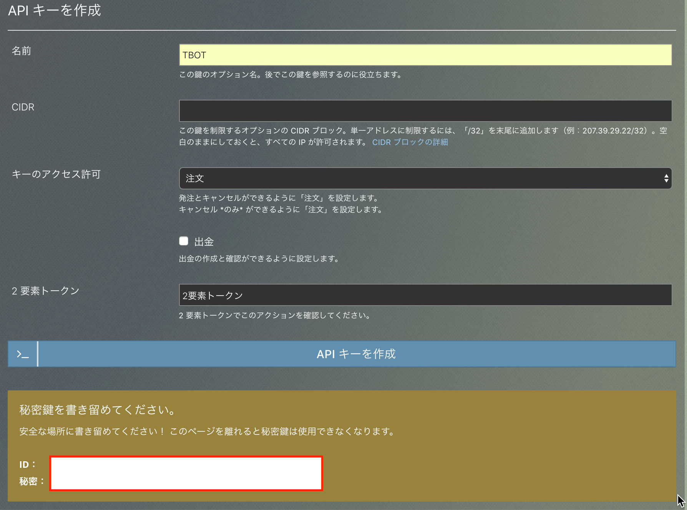

# TBOT v1 マニュアル

## 目次
<!-- TOC -->

- [TBOT v1 マニュアル](#tbot-v1-マニュアル)
  - [目次](#目次)
  - [始め方](#始め方)
    - [用意するもの](#用意するもの)
      - [LINE notify token](#line-notify-token)
      - [BITMEX API key と API secret](#bitmex-api-key-と-api-secret)
    - [初期設定](#初期設定)
    - [注意すべき点](#注意すべき点)
  - [細かい設定方法](#細かい設定方法)
    - [ストップロス](#ストップロス)
    - [ピラミッディング](#ピラミッディング)
  - [細かい仕様](#細かい仕様)
    - [本アプリケーションの動作仕様](#本アプリケーションの動作仕様)
    - [注文のロジック](#注文のロジック)

<!-- /TOC -->

----------

## 始め方
本項ではこのbotを使うにあたって用意すべきものを紹介し、まず注文を入れて見るところまでを説明します。また、設定時の注意点なども合わせて紹介します。
### 用意するもの
大まかに2つあります.
#### LINE notify token
* みなさんLineについては言わずもがな持っているかと思います。今回はLineに対してプログラムが通知を送るための準備をします。
  
  Line notify とはプログラムから自分のLineへ通知を送る際に使うサービスです。その際Line notify tokenという個人に紐付いたトークン(ランダムな文字列)が必要になります。  
* トークンの取得方法
  * [Line notify](https://notify-bot.line.me/ja/)へアクセスしてログイン
  * 右上の∨を押してマイページへ移動
  * 下の方に行くとトークンを発行するというボタンがあるので選択
  * トークン名を適当な名前にし、1:1でLine notifyから通知を受け取るを選択し、発行します。
  * すると、このような画面が表示され、真ん中のエリアにトークンが表示されるのでこちらをメモなどに控えておきましょう。
#### BITMEX API key と API secret
* BITMEXにおいて、プログラムから注文を発行したり、ポジションの情報を取得するためにBITMEX API keyおよびAPI secretというものが必要になってきます。
* apikey secretの取得方法
  * 本アプリケーションを購入いただいた段階でBitmexのアカウントは持っているかと思いますので、アカウント作成などは割愛いたします。
  * BITMEXの上段メニューにAPIという項目があります(画像上四角)。これを押すと画像のような画面になり、左側に「APIキーの管理」という項目がありますのでこれを押します。
  * するとAPIの発行フォームが出てくるので適切な値を入れます。
    * 名前は適当なものをつけておくとよいでしょう。
    * キーのアクセス許可は注文にします。
    * 出金については本ボットでは触れることはないのでチェックを付けないようにしてください。(漏洩した場合大変なことになりますので)
    * 2要素トークンを入力し、発行を押すと下の方にAPIキーとシークレット(秘密)が表示されるのでメモしておきましょう。
    * 

### 初期設定
### 注意すべき点
-----
## 細かい設定方法
### ストップロス
### ピラミッディング
-----
## 細かい仕様
### 本アプリケーションの動作仕様
### 注文のロジック
