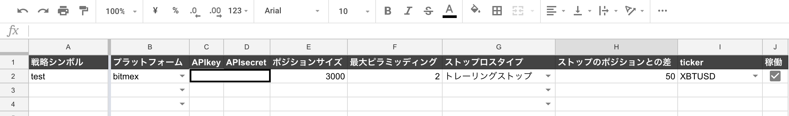
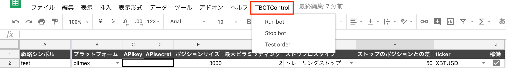

# TBOT v1 マニュアル

## 目次
<!-- TOC -->

- [TBOT v1 マニュアル](#tbot-v1-マニュアル)
  - [目次](#目次)
  - [始め方](#始め方)
    - [用意するもの](#用意するもの)
      - [LINE notify token](#line-notify-token)
      - [BITMEX API key と API secret](#bitmex-api-key-と-api-secret)
      - [Tradingviewの有料アカウント](#tradingviewの有料アカウント)
    - [初期設定](#初期設定)
      - [TBOT本体](#tbot本体)
      - [Tradingviewの設定](#tradingviewの設定)
      - [実際にテスト](#実際にテスト)
    - [注意すべき点](#注意すべき点)
  - [細かい設定方法](#細かい設定方法)
    - [ストップロス](#ストップロス)
    - [ピラミッディング](#ピラミッディング)
  - [細かい仕様](#細かい仕様)
    - [本アプリケーションの動作仕様](#本アプリケーションの動作仕様)
    - [注文のロジック](#注文のロジック)
    - [](#)

<!-- /TOC -->

----------

## 始め方
本項ではこのbotを使うにあたって用意すべきものを紹介し、まず注文を入れて見るところまでを説明します。また、設定時の注意点なども合わせて紹介します。
### 用意するもの
大まかに2つあります.
* 通知系
* Line notify token
  * プログラムからLineへ通知を送る際に必要です。
* BITMEX APIKEY and api secret
  * 発注の際に使います
* Tradingviewの有料アカウント
#### LINE notify token
* みなさんLineについては言わずもがな持っているかと思います。今回はLineに対してプログラムが通知を送るための準備をします。

  
  
* Line notify とはプログラムから自分のLineへ通知を送る際に使うサービスです。その際Line notify tokenという個人に紐付いたトークン(ランダムな文字列)が必要になります。  
* トークンの取得方法
  * [Line notify](https://notify-bot.line.me/ja/)へアクセスしてログイン
  * 右上の∨を押してマイページへ移動

    
  * 下の方に行くとトークンを発行するというボタンがあるので選択

    
  * トークン名を適当な名前にし、1:1でLine notifyから通知を受け取るを選択し、発行します。

    
  * すると、このような画面が表示され、真ん中のエリアにトークンが表示されるのでこちらをメモなどに控えておきましょう。

    
  * これで、Line notifyトークンの発行は完了です。
#### BITMEX API key と API secret
* BITMEXにおいて、プログラムから注文を発行したり、ポジションの情報を取得するためにBITMEX API keyおよびAPI secretというものが必要になってきます。
* apikey secretの取得方法
  * 本アプリケーションを購入いただいた段階でBitmexのアカウントは持っているかと思いますので、アカウント作成などは割愛いたします。
  * BITMEXの上段メニューにAPIという項目があります(画像上四角)。これを押すと画像のような画面になり、左側に「APIキーの管理」という項目がありますのでこれを押します。

    
  * するとAPIの発行フォームが出てくるので適切な値を入れます。
    * 名前は適当なものをつけておくとよいでしょう。
    * キーのアクセス許可は注文にします。
    * 出金については本ボットでは触れることはないのでチェックを付けないようにしてください。(漏洩した場合大変なことになりますので)
    * 2要素トークンを入力し、発行を押すと下の方にAPIキー(ID)とシークレット(秘密)が表示されるのでメモしておきましょう。

    
  * これで、api key secretの取得は完了です。
#### Tradingviewの有料アカウント
* この商品を買っていただいた段階でTradinviewのアカウントは持っていただけていると思いますが、アラートを複数作る場合は有料のアカウントが必要です。
* こちらの[有料プラン選択](https://jp.tradingview.com/gopro/)で有料プランを選択してください。少なくとも4つのアラートが作れれば一つの戦略を運用できると思いますので最も安いものでも大丈夫だと思います。
### 初期設定
#### TBOT本体
* noteにてあるTBOTのリンクを踏むとTBOT v1というシートが開かれます。
* 左上のファイルを選択し、コピーを作成を選択します。
* マイドライブに保存を選択すると自分のGoogle Driveに保存されます。

  
* 次に、「調整項目」というシートを開いてください(おそらく最初に開かれているはずです)。
* こちらにはbotの基本的な情報を入力します。
* 一旦下の２つを消して、1行にした状態で設定しましょう。(複数回したい場合は都度追加していってください)
* それぞれの項目について説明します。
  * 戦略シンボル 
    * 必須
    * 戦略の名称です
    * Tradingviewにおいてアラートメッセージを設定するときにこれと同じシンボルを指定することで対応させることができます。
  * プラットフォーム
    * 必須
    * ▼を押すと選択肢が現れます。
    * bitmexかbitmex_testネットしか無いです。
  * APIkey, APIsecret
    * 必須
    * プラットフォームに対応するapikeyとapisecretを入力します。
    * bitmexであれば先程説明したものをそれぞれ入力してください。
  * ポジションサイズ
    * 必須
    * 一回の注文で入れる契約サイズです。
  * 最大ピラミッディング
    * 必須
    * ピラミッディングの回数を指定します。
    * ポジションサイズを分割ではなく、そのまま発注するので、サイズ3000でピラミッディング2であれば、2度発注した場合3000*2 = 6000となります.
  * ストップロスタイプ
    * 必須
    * 注文発注時に同時にストップロスを入れるかどうかについて設定します。
    * ストップロス、トレーリングストップ、無しの3択です。
  * ストップのポジションとの差
    * ストップロスタイプが無しでないときに必須
    * ストップロスのポジションとの差額を設定します。
    * 単位は商品の契約サイズですので、btc/altなどの取引のとき、0.0001ずらしたいときはそのまま入力してください.
  * ticker
    * 必須
    * プラットフォームにおける商品ペアです.
    * プラットフォームを変更すると自動で選択肢が切り替わります。
  * 稼働
    * オンオフをチェックボックスで切り替えることができます。
    * オフであればbotが稼働中でも当該戦略は動きません。

    
* メッセージ設定
  * 次に通知周りの設定をします.
  * 「メッセージ」シートを開いていただくと、画像のような入力フォームがあります.
  * プラットフォームはLineとslackを選択できます。
  * Lineの場合先程説明してあるLine notifyトークンを入力していただければ通知が来るようになります。
  * slackについてはincoming webhook urlを入力していただければ大丈夫です。詳しいことはwebを検索していただければわかると思います。

    

* 上記の入力が完了したら、次にメニューバーを見ると、「TBOTControl」というものが表示されており、こちらを押すと、
  * Run bot - botを稼働させる. 1分ごとにアラートを監視
  * Stop bot - botを停止させる
  * Test order - 1回だけbotを実験する.
* という3つの選択肢があります.
* こちらはbotの稼働やテストをしてくれるもので、
一度Test orderをすると入力項目のチェックとメッセージがちゃんと送れるかどうか、メールが来ていたらちゃんとオーダーを送ることができるかをチェックすることができます。
* では1回Test orderをしましょう
  * このとき、Tradingviewからアラートメッセージが来ていて未読な場合、エラーが発生しますので、一旦それを既読にするか削除にしておきましょう。
  * 調整項目およびメッセージが正しく入力されていれば「テストメッセージ」という文面が通知媒体に流れて、エラーなく終わるはずです。エラーが出た場合はメッセージに従って入力項目を修正してください。

    

#### Tradingviewの設定
* アラートメッセージの送信先を設定します。
  * 送信先についてはTradingviewのプロフィール設定から設定できます.
  * こちらのEmailの部分にTBOTを使うgoogleアカウントのメールを送信していただければ大丈夫です。
    

  * ※アラート自体の設定方法は割愛します。[Tradingview上で戦略に応じてアラートメッセージを設定する方法](https://blog.tradingview.com/ja/alerts-in-pine-1633/).
  * 1つのアラートメッセージに含むことができる情報は２つです.
    * 命令4つのどれか「Long, Short, CloseLong, CloseShort」
    * 戦略シンボル
  * この２つを以下のように設定します。
      
    ```strategy-operation:命令:strategy-operation strategy-symbol:戦略シンボル:strategy-symbol```

  * 実際の設定だと画像のとおりになります。
  
    
* この場合、戦略シンボルが「test」のもので、Shortオーダーを出してくれるものです。
* これを戦略に従ってLong Short(exitするのであればClose系)を設定すればTradingviewの設定は大丈夫です(サンプルストラテジーを参考に設定する例)。

#### 実際にテスト
 

### 注意すべき点
-----
## 細かい設定方法
### ストップロス
### ピラミッディング
-----
## 細かい仕様
### 本アプリケーションの動作仕様
### 注文のロジック
### 